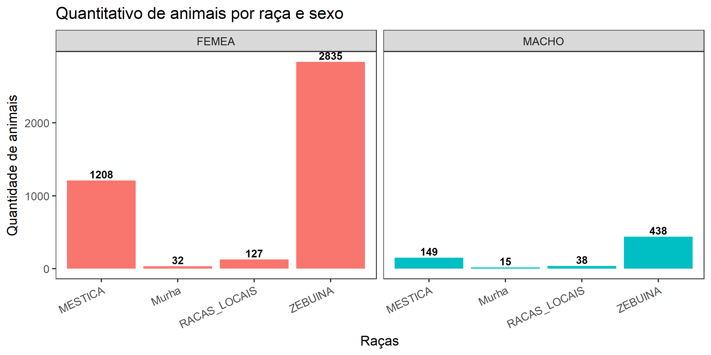

# Mestrado Veterinaria UFG

Mestrado Veterinária - UFG

### Descrição do projeto

### Banco de dados

[Download](../../raw/master/src/data/dados_zootecnicos_e_ambientais.csv) 3.34 MB

**4842** Observações  
**86** Variáveis  

### Estatística descritiva dos dados

### Seleção dos animais da pesquisa

Para se obter uma amostra representativa, definiu-se que a população se daria por estatística de amostragem estratificada.  
A metodologia seguiu os seguintes passos:

1. Estratificar (agrupar) os animais em: município, região, sexo, faixa de idade e raça;
2. Calcular a frequência relativa dos estratos (percentual de representação de cada estrato em relação ao todo);
3. Calcular o número de indivíduos a ser selecionado em cada estrato, que represente o mesmo percentual da frequência relativa. Ponderando-se uma proporção representativa para se atingir os 95% de índice de confiança da pesquisa;
4. *(Controle)* Validar se o **n** número de indivíduos a ser sorteado em cada estrato, não extrapola o total de indivíduos no estrato;
5. Selecionar para cada estrato, a lista de todos os indivíduos de onde se irá sortear o **n** número de elementos que representa a proporção do estrato;
6. Consolidar todos os indivíduos sorteados em uma lista única e exporta-la.
